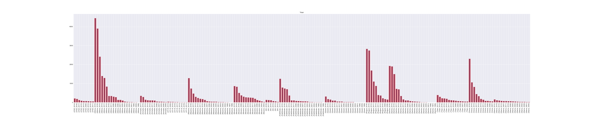
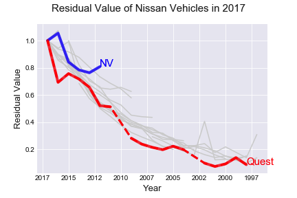
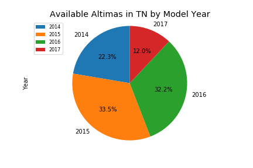

# Project 1 | Collaborations with Git
Group IV
---
* Michael Cherkassky
* Catie Clark
* Garet Douglass
* Anna Givens
* John Patten

## Objective 
Obtain dataset and collaborate within our group to answer a set of self-drafted questions by utilizing Pandas dataframes and visualizations through MatPlotLib. 
  * Jupyter Notebook Files located in repository 
      * Cleaned Data.ipynb, Group Project-(FINAL).ipynb
  * Below you will find each individual's question, visualizations and the conclusions of the questions/findings.

# Used Nissan Car Listings Analysis

## I. Research and Analyze Data from True Car Listing
* Determine the following:
  * Vehicle availability in TN and US Market
  * Vehicles available by Model Year
  * Model Year and Mileage Impact on Price
  * Model Year and Resale Price
  * Residual Value by Model and Model Year

* Our dataset was obtained via [Kaggle - Used Car Listings](https://www.kaggle.com/jpayne/852k-used-car-listings#true_car_listings.csv). 
  *  Data included
     : Year, Make, Model, Price, VIN, City, State
* Contains the following limitations:
    * Listings that were live on September 24, 2017
    * Model Years between 1997-2017

* **NOTE** For the purpose of this project, we limited the data to **only include Nissan** makes which reduced the 1mil rows of the original dataset to ~65k rows. *Please see the end of this document for the full list of limitations.* 

--------

# Vehicle Availability in TN and Surrounding Areas + General Trends | Catie Clark
* What Nissan model is the most available in Tennessee? *Altima*

## Findings:
* Prework, group the state by region/territory names for comparative analysis 

            '''
            #Grouping the most available car for each state by region
            region = mostavailable_df.groupby('Region')
            regioncount = region['Most Available Model'].value_counts()
            regioncount
            '''

    
* Nissan: **total listings 66,250**
    * when grouped by state --> 59 (prior to consolidating duplicates, VA)
    * All Models listed in Tennessee: 'Versa', 'Altima', 'Sentra', 'Rogue', 'Maxima', 'Murano','Titan', 'Quest', 'Pathfinder', 'Xterra', 'NV', 'Armada', '370Z','GT-R'
    
* **United States:** 
    * southeast/southwest: Altima most available (only 1 state did not have Altima as highest number of listings)
    * midwest (plains): there are more states with Rogue as highest number of listings than Altima as the highest
    * Alaska: only state with most Pathfinder listings
    * Nevada/Hawaii: only two states with most Versa listings

* **Tennessee:** 1976 listings, Altima is the most available

# Vehicles available by Model Year in Overall Market, Garet Douglass

# Model Year and Mileage Impact on Price | Michael Cherkassky
* What is the correlation between odometer reading and sale price for Nissan models?

## Findings:
* Both age and mileage of a given Nissan vehicle hold **only a moderate correlation** to the vehicle’s price.
* With a **50% correlation**, the vehicle’s mileage only slightly edges out the vehicle’s age (47% correlation).
* With these figures, we cannot say either mileage or age have a strong correlation to the vehicle’s listing price, so a potential buyer should not hold much weight in one category over the other.

# Model Year and Resale Price | Anna Givens
* What is the relationship between Nissan model and resale price?

## Findings:
* The mean price of a used Nissan is **$16,602 (USD)**
* When sorting by the highest price, there are some listings of non-luxury or sport vehicles (Altima, Sentra) that are priced extremely high and seem inaccurate (ex. 99,999).  This may be an attempt by the listing party to appear at the top of the list when sorted by price or a typo. 
* GT-Rs have the highest entry price in the resale market of any used Nissan listing in this dataset. 
* The lower quartile of price(USD) is $1,500 
  * 25% $11,950 
  * 50% $15,000 
  * 75% $19,990 
  * and upper quartile $121,495

# Residual Value by Model and Model Year | John Patten
* What is the model depreciation over time as estimated by the listing price?

## Findings:
* Residual value is related to the lifespan of the *model*.
* Possible explanation: **novelty vs. substitution.**
* **Best car to buy this year** for resale next year?
    * New-ish year of the newest model
    * Older year of an older model

--------
# List of Limitations
1. Listings that were live on September 24, 2017 on Truecar.com
2. Model Years between 1997-2017
3. Original dataset included over 1mil rows and was too large to work with for the purpose of this project. 
4. We then reduced the original dataset to only show Make == Nissan and saved that as a new dataframe in which we all worked out of. 

          nissan_df = car_df.loc[car_df["Make"]=="Nissan"]
          nissan_df.head()
          '''

5. The 'Model' column was a challenge to work with, it included extra information with the model that we weren't interested in. The additional characters were both numbers and letters, which made splitting the values more challenging. To resolve this roadblock we created a new column 'New_Model' which only included the model names from a nissan_models.csv. This allowed us to cycle through each row in a for loop and create a 'New_Model' column with the information we were seaking to evaluate. 

'''  

      for model in models:
          nissan_df.loc[nissan_df["Model"].str.contains(model, regex=False), "New_Model"] = model
          '''

# II. After initial research, collaborate on findings and comprise data to an overall theme
## All about Altimas! 
* Now that we've seen the data regarding factors like availability and residual value, let's see how we can apply this to buying a used car. 

### Problem:
  * Shopping for a used vehicle can be difficult. You want to make the best investment, but it's hard to know if you are getting the best price/value or if there are other vehicles listed that best suit your needs. 
  * Our hypothetical customer is looking for a Nissan Altima listed in Tennessee with a budget of $15,000. What car do we recommend based on what is available in this dataset?
  
### Goal:
* Find a listing of a used Nissan Altima that we would recommend within these **qualifiers: 
 * **Budget: <= $15,000
 * **Location: Tennessee 
  
* Is the asking price for this particular car reasonable given the information provided in the dataset. 
What are other vehicles could we recommend? (Slightly overbudget, higher mileage, outside geographic location.)

## Review Altima Models Available in TN

### Null Hypothesis  
* Can we find a used Nissan Altima listed in Tennessee that fits our hypothetical customer's requirements?
    * Hypothesis - If the Nissan Altima is the most listed vehicle in Tennessee and the mean price of all used Nissan's is $16,

  * Null Hypothesis - If dark chocolate is not related to arterial function in healthy individuals, then consuming 30g of dark chocolate over for 1 year will show no improvement in arterial function.

* Determining model availability in Tennessee
     
       '''
       tn_df = nissan_df.loc[nissan_df['State']==' TN']
       tn_df.set_index('Vin')
       tnmodel = tn_df.groupby('New_Model')
       tnmodelcount = tnmodel['Vin'].count()
       tnmodelcount.head(10) 
       '''
* Limit data to only include Altimas

      '''
      altima_df = tn_df.loc[tn_df['New_Model']=='Altima']
      tn_df.set_index('Vin').head(30)
      '''
      

### Recommendation + Additional Options
| Recommendation | Vin	|Price | Year |	Mileage |	City,	State |	Model |
|---  |---   |---   |---      |---      |---    |---    |							
| Best |1N4AL3AP3GC218263 |	$12,495 |	2016 |	32,341 |	Columbia	TN	| Altima |
| Second | 1N4AL3AP7GN367909	| $13,425	| 2016 |	40,256 |	Memphis	TN	|	Altima |
| Third | 1N4AL3AP3GC197866	| $13,825	| 2016	| 38,536	| Nashville	TN	|	Altima |
| Fourth, 1 yr Older /Close to Budget | 1N4AL3AP5FC431407	| $14,225 |	2015	| 27,753	| Clarksville	TN	|	Altima |
| Fifth, Slightly Over Mileage | 1N4AL2AP0CN410488 |	$7,975 |	2012	| 51,003 |	Knoxville	TN	|	Altima |
